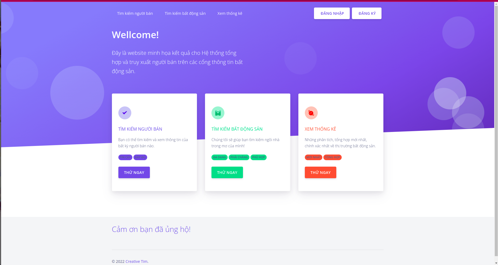

# graduation_project

# Cấu trúc code gồm 3 folders
- backend: Code chạy backend cho website khai thác dữ liệu 
- frontend: Code chạy frontend cho website khai thác dữ liệu
- model: Code chạy mô hình đề xuất của đồ án

# Hướng dẫn cài đặt
1. Cài đặt website khai thác dữ liệu người bán

Bước 1: 