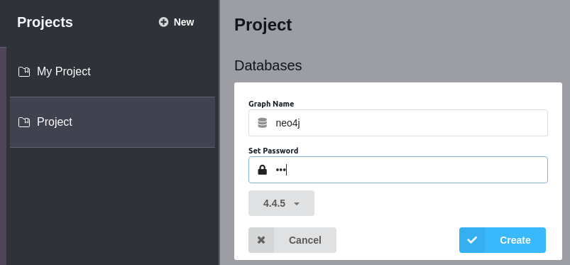

# graduation_project

# Cấu trúc code gồm 3 folders
- backend: Code chạy backend cho website khai thác dữ liệu 
- frontend: Code chạy frontend cho website khai thác dữ liệu
- model: Code chạy mô hình đề xuất của đồ án

# Hướng dẫn cài đặt
1. Cài đặt Neo4j

* Bước 1: Truy cập đường link https://neo4j.com/download/, cài đặt Neo4j Desktop phiên bản mới nhất.

* Bước 2: Mở Neo4j Desktop

* Bước 3: Tạo Project mới: Tại tab Project nhấn "New".

* Bước 4: Tạo database: Nhấn "Add Database" -> Nhấn "Create a Local Graph" -> Nhập các thông tin của database như hình dưới.

Cuối cùng nhấn "Create"

* Bước 5: Dump dữ liệu vào database: Mở terminal của database --> gõ lệnh sau vào terminal

./bin/neo4j-admin load --from=path/to/dumpfile.dump --verbose

Truy cập link sau để biết thêm về dump dữ liệu vào Neo4j: https://neo4j.com/docs/operations-manual/current/backup-restore/restore-dump/

2. Cài đặt website khai thác dữ liệu người bán

2.1 Cài đặt môi trường backend 

* Bước 1: Di chuyển vào thư mục backend

        cd backend

* Bước 2: Tạo môi trường conda để chạy code python

        conda create --name env_name python=3.9

        conda activate env_name

        pip install requirements.txt

* Bước 3: Chạy backend

        export FLASK_APP=api

        export FLASK_ENV=development

        flask run -p 5000

2.2 Cài đặt môi trường frontend

* Bước 1: Di chuyển vào thư mục backend

            cd frontend

* Bước 2: Cài đặt các thư viện 

            yarn

* Bước 3: Chạy frontend

        yarn start

3. Cài đặt mô hình đề xuất 

* Bước 1: Di chuyển vào thư mục model

        cd model

* Bước 2: Tạo môi trường conda để chạy code python

        conda create --name env_model python=3.9

        conda activate env_model

        pip install requirements.txt

* Bước 3: Mở file crontab để lập lịch chạy cho hệ thống

* Bước 3.1: Lập lịch chạy thu thập dữ liệu

        18 0 * * * /path/to/conda/env_model/bin/python /path/to/folder/model/src/crawl_process.py --mode 1

        0 0 * * * /path/to/conda/env_model/bin/python /path/to/folder/model/src/crawl_process.py --mode 2

        0 12 * * 6 /path/to/conda/env_model/bin/python /path/to/folder/model/src/extract_and_save.py

* Bước 3.1: Lập lịch truy xuất thông tin người bán

        0 21 1 * * /path/to/conda/env_model/bin/python /path/to/folder/model/src/extract_seller.py

* Bước 3.2: Lập lịch phân tích dữ liệu

        20 23 1 * * /path/to/conda/env_model/bin/python /path/to/folder/model/src/analyze_data.py

* Bước 4: Cài đặt selenoid

Di chuyển đến thư mục selenoid

        cd selenoid

Chạy selenoid

        ./selenoid_linux_amd64 -limit số_cpu

Truy cập link https://aerokube.com/selenoid/latest/#_starting_selenoid_manually để đọc thêm về cách cấu hình selenoid.

